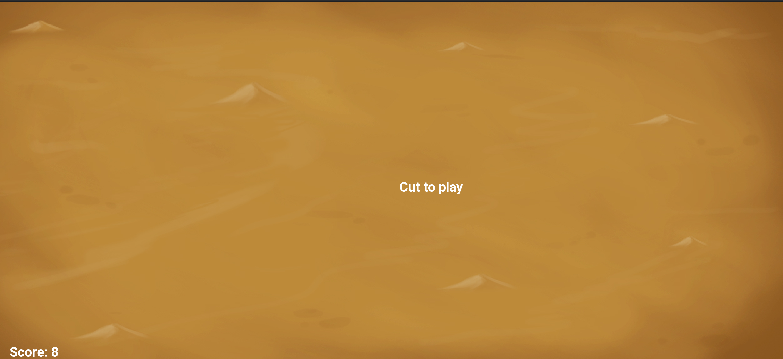
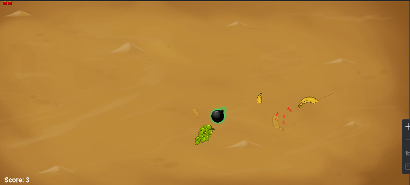
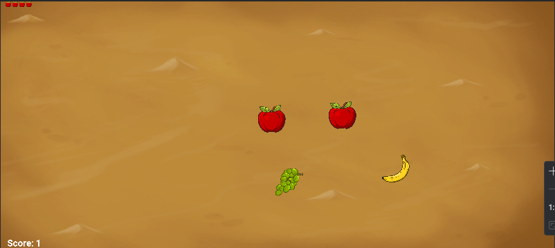

# 🍉 Fruit Ninja Clone (LibGDX)

Bu proje, **LibGDX** kullanılarak geliştirilmiş bir **Fruit Ninja klonu** oyunudur.  
Oyuncu, ekrana dokunarak veya fare ile sürükleme yaparak meyveleri keser.  
Her kesilen meyve puan kazandırır, bombalar ise can kaybettirir.  
Canlar bitince oyun sona erer.

---

## 🎮 Özellikler
- ✅ **Meyve çeşitleri:** Muz, üzüm, elma, limon  
- ✅ **Ekstra öğeler:** Bombalar 💣, can artıran coinler 🪙  
- ✅ **Neon Blade efekti:** Oyuncunun parmağını/ faresini takip eden ışıklı iz  
- ✅ **Parçalanma animasyonu:** Meyveler kesildiğinde ikiye ayrılır  
- ✅ **Parçacık efektleri:** Kesilen meyveden renkli partiküller çıkar  
- ✅ **Skor ve Can Sistemi:** Ekranın üst kısmında gösterilir  
- ✅ **Arka plan müziği:** Döngüsel olarak çalar 🎵  

---

## 📷 Ekran Görüntüleri

  
  
  

---

🚀 Kurulum ve Çalıştırma
- Bu repository’yi klonla:
  **git clone https://github.com/<kullanici-adi>/fruit-ninja-clone.git**
- Projeyi Android Studio veya IntelliJ IDEA içinde aç.
- assets/ klasörüne aşağıdaki dosyaları ekle:
- backround.jpg (arka plan resmi)
- banana.png, green-grape.png, red-apple.png, lemon.png (meyveler)
- bomb.png, coins.png (özel objeler)
- music.mp3 (arka plan müziği)
- robotobold.ttf (font dosyası)

**Projeyi çalıştır ve oyunun tadını çıkar 🎮**

---

## - **Demo GIF**

  

---

## 🛠️ Kullanılan Teknolojiler

**LibGDX**
 - Java tabanlı oyun geliştirme framework’ü

**Java**
- Android Studio / IntelliJ IDEA
  
  ---
